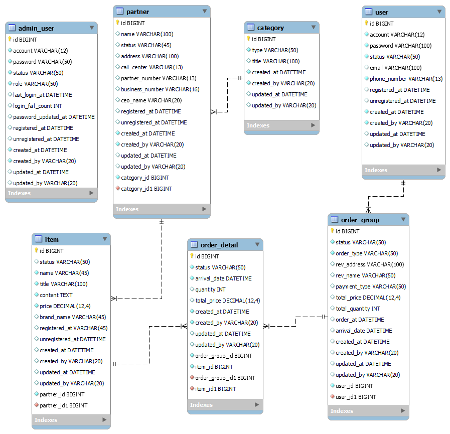

Adminpage App
=====================
종합 쇼핑몰을 운영하시나요? 쇼핑몰 관리자 서비스가 필요하다면 Adminpage App을 이용해보세요!

 

 

📝 About The Project
-----------------------------------------
Adminpage App은 Java로 만들었으며, Spring Boot로 서비스를 구현한 프로그램입니다.

MySQL Workbench 툴을 이용해 ERD 설계 및 Table 생성을 진행했습니다.

세부 내용은 아래와 같습니다.
1. 전자제품, 의류, 인테리어, 음식, 스포츠 등의 category가 있습니다.
2. 각 repository마다 CRUD 메서드를 구현했습니다.

💭 Next Version Preview
-----------------------------------------
현재 http://localhost:8080/pages 링크만 구현한 상태로
고객 관리 페이지(localhost:8080/pages/users)는 구현되지 않은 상태입니다.
다음 버전에서는 고객 관리 페이지에서 회원의 ID, 계정, 상태, e-mail, 전화번호, 가입일, 해지일을
확인할 수 있도록 수정될 예정입니다.

또한, 다음 버전에서는 외부에서도 로컬에 적용 가능하도록 업데이트할 계획입니다.

© Copyright
-----------------------------------------
본 adminpage는 FAST CAMPUS와 함께 제작한 것입니다.
